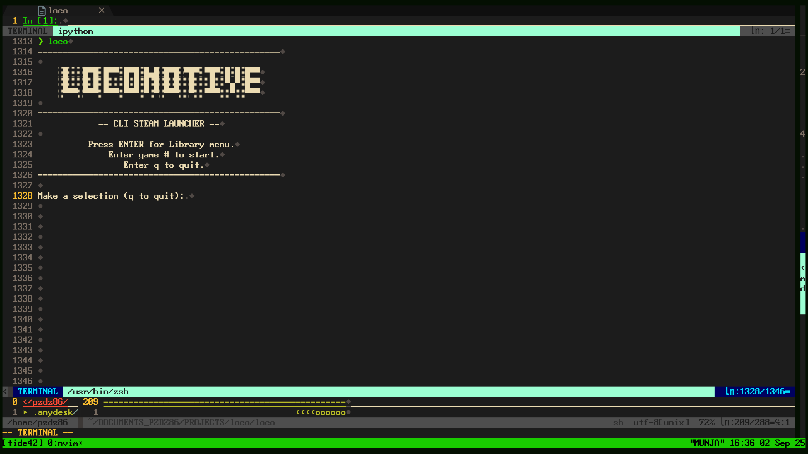
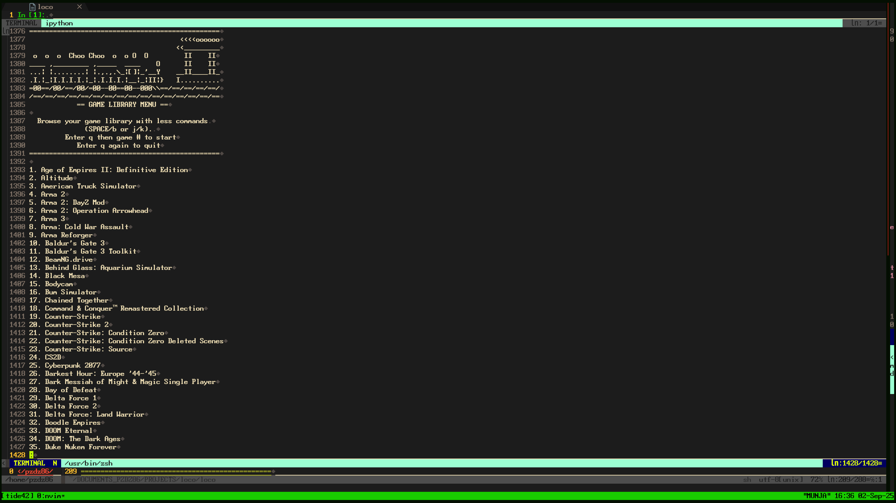
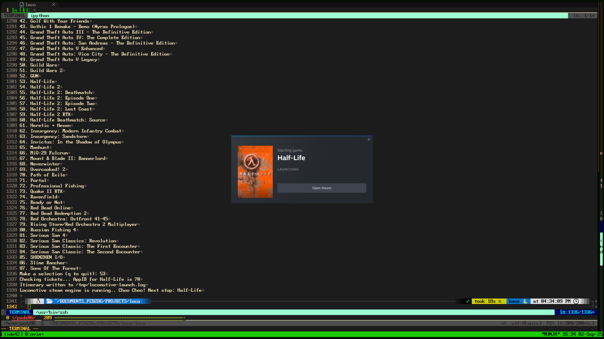

================================================

      ░█░░░█▀█░█▀▀░█▀█░█▄█░█▀█░▀█▀░▀█▀░█░█░█▀▀    
      ░█░░░█░█░█░░░█░█░█░█░█░█░░█░░░█░░▀▄▀░█▀▀    
      ░▀▀▀░▀▀▀░▀▀▀░▀▀▀░▀░▀░▀▀▀░░▀░░▀▀▀░░▀░░▀▀▀    

================================================

A command-line Steam launcher for Linux to browse and launch games with a interface.

## Features
- Browse Steam library using `less` (SPACE, b, j/k or arrow keys).
- Launch games by number, quit with `q`.
- Supports native Steam and Flatpak.
- Keeps Steam UI minimized in the background *unless there are relevant messages or shader caching.
- Truncates logs for clean runs.
- Customizable non-game filtering via `~/.config/locomotive/non_games.conf`.
- Train-themed ASCII art and messages.
- Launch your favorites quickly with the command `locomotive` followed by your favorite games ID number e.g. locomotive 42.
- Game ID matches the games position in the library menu.

## Requirements
- **OS**: Linux
- **Tools**: `bash`, `awk`, `sort`, `less`
- **Steam**: Native or Flatpak (`com.valvesoftware.Steam`)

## Installation
- git clone https://github.com/logicmagix/locomotive
- cd ...locomotive/ and chmod +x install.sh
- Run ./install.sh

## Uninstallation
- chmod +x uninstall.sh from within the Locomotive repo
- ./uninstall.sh

## Usage
1. Run `locomotive`.
2. Press Enter to view the game library menu.
3. Navigate with SPACE/j (down), b/k (up), q (exit menu).
4. Enter a game number to launch or `q` to quit.
5. Press Enter to reuse the last selection or reopen the menu.

## Customization
- **Non-Game Filtering**: Add AppIDs of non-game entries (e.g., tools, DLCs) to `~/.config/locomotive/non_games.conf`, one integer per line or use the `add` command in the Locomotive interface.

## Screenshots

### Locomotive Interface

### Locomotive Library

### Locomotive Launch

